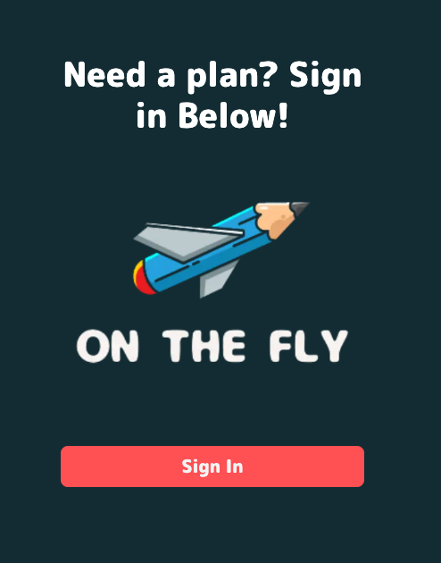
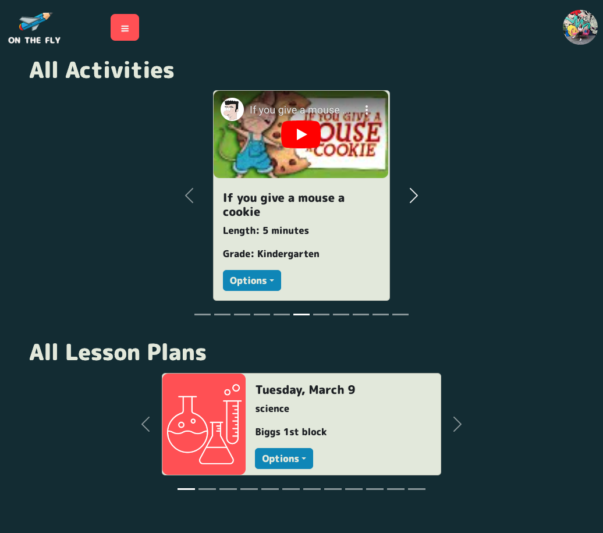
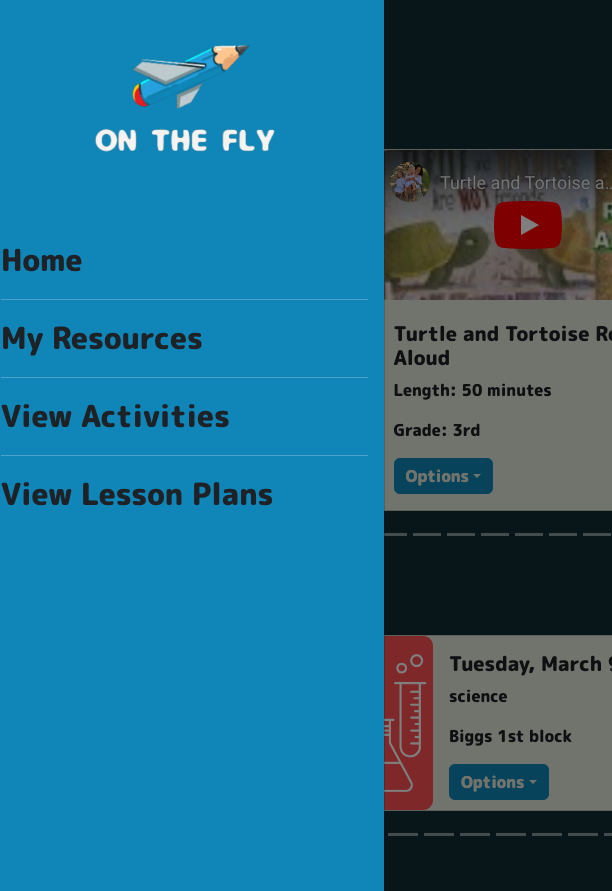
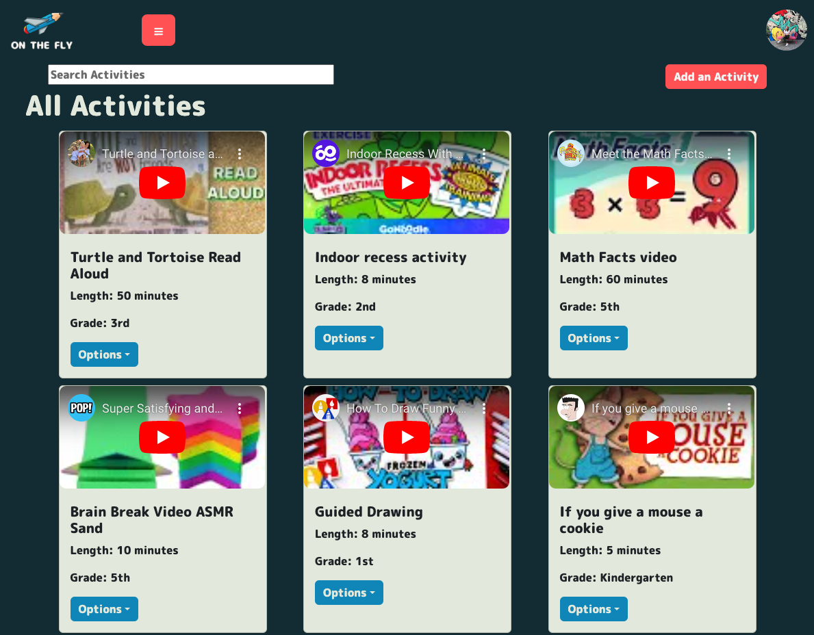
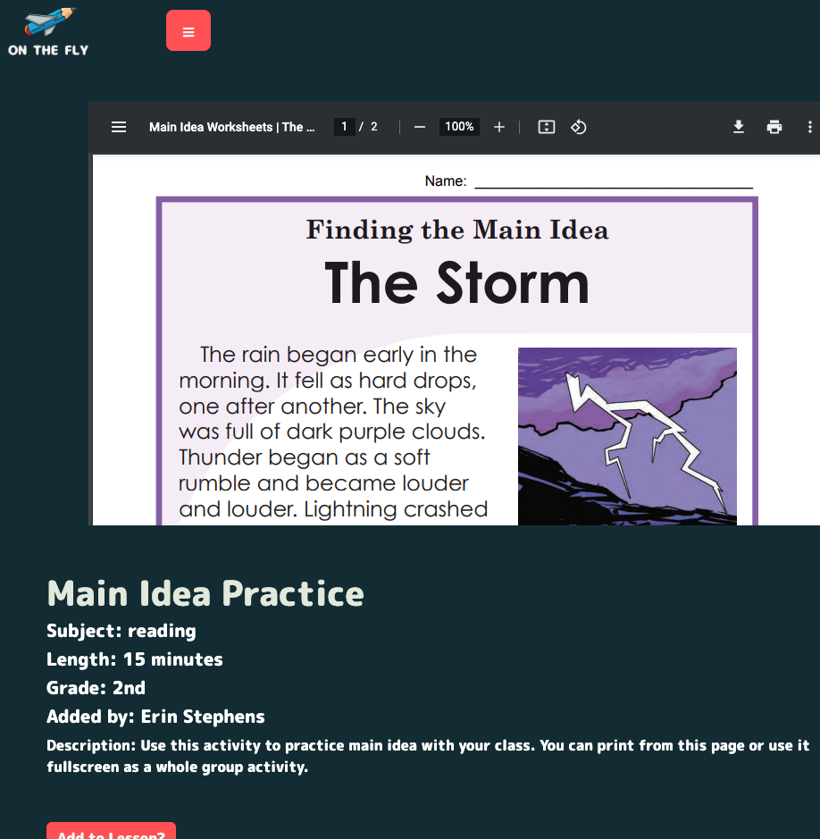
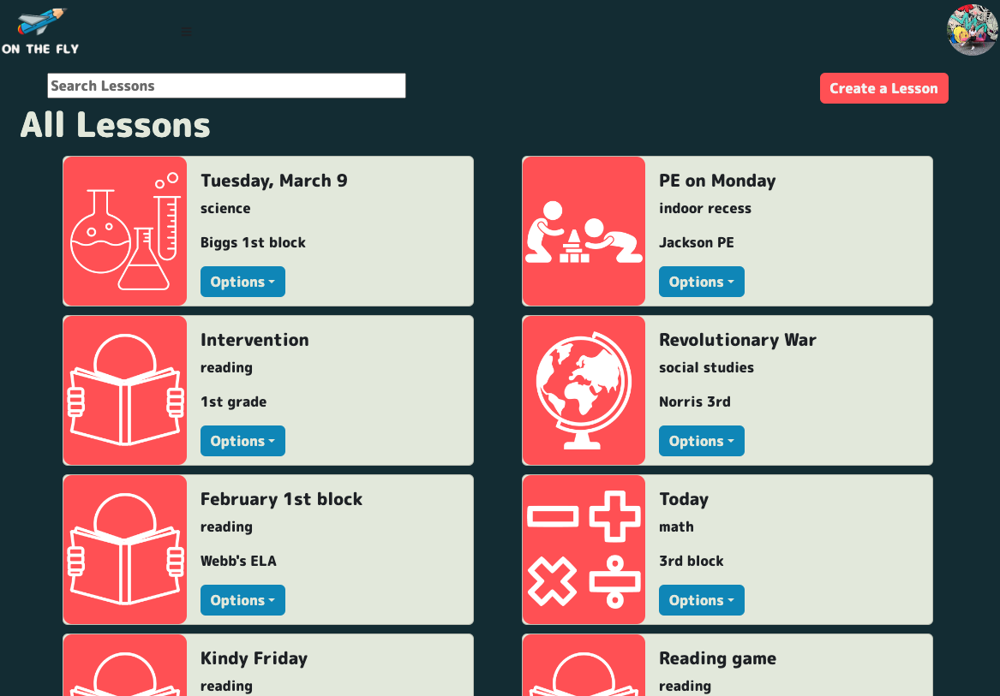
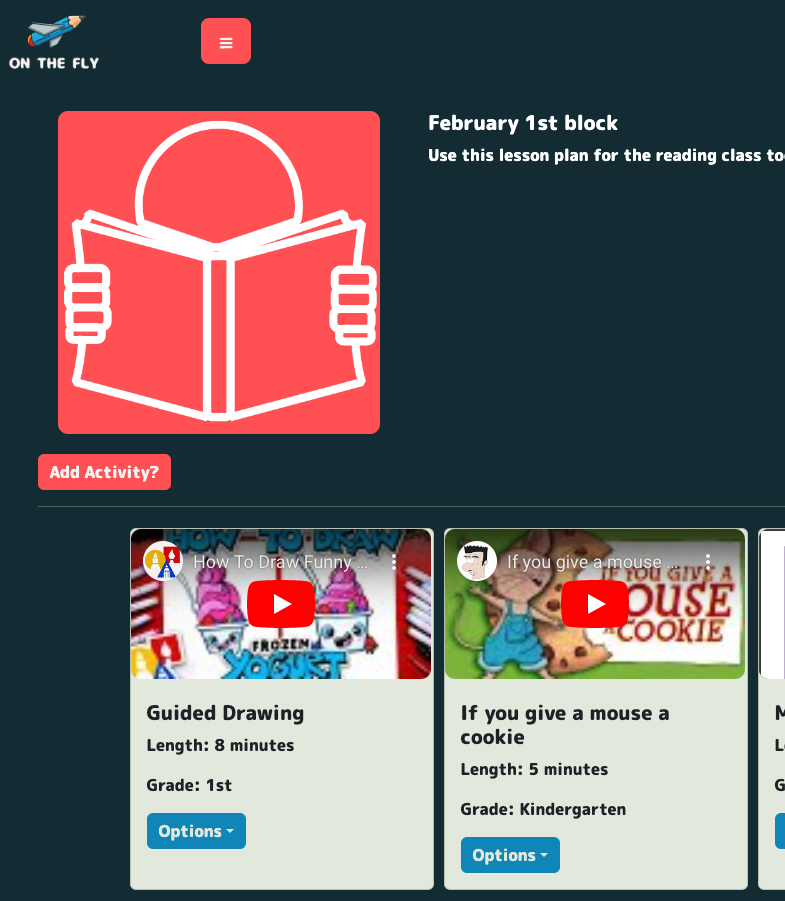

# On the Fly  [](https://app.netlify.com/sites/on-the-fly/deploys)

Teachers and substitutes are often asked to cover classes without warning. This app serves as a spot for teachers to collect activities and make lesson plans to use when they are unable to prep. 

[View On the Fly](https://on-the-fly.netlify.app/)

## About the User <!-- This is a scaled down user persona -->
- Ideal user for this application is a teacher or a substitute.
- The user needs quick activties for their students because they forgot to make lesson plans.
- The user has too many responsibilities and not enough time to make plans, so using the app with give them quick ideas.
- The user may not be a certified teacher and needs activities for students to do.
- The user needs activities to fill unstructured time. 

## Features <!-- List your app features using bullets! Do NOT use a paragraph. No one will read that! -->
- When an activity is added, an object is created and pushed to the array of activities. 
- Users can view, edit, and delete their created items, but can only view items created by other users.
- Users can add activities to lesson plans to create groups of activities. 
- Users can search through all activities and all lessons. 

## Video Walkthrough of APP NAME <!-- A loom link is sufficient -->
to come

## Relevant Links <!-- Link to all the things that are required outside of the ones that have their own section -->
- [Check out the deployed site](https://on-the-fly.netlify.app/)
- [Wireframes](https://www.figma.com/file/DGTIGuJzeUIt1METnEVVef/On-the-Fly?node-id=0%3A1&t=7eeuzuUqz1enZxvi-0)
- [PlanningProcess] (https://www.figma.com/file/jo3UM8TeAbuGe7gwbqL2xf/On-the-Fly-Ideas?t=7eeuzuUqz1enZxvi-0)
- [Project Board](https://github.com/users/erin-stephens/projects/4/views/1)

## Code Snippet <!-- OPTIONAL, but doesn't hurt -->
```
export default function AddActivitytoLesson({ obj }) {
  const [show, setShow] = useState(false);

  const handleClose = () => setShow(false);
  const handleShow = () => setShow(true);

  const [formInput, setFormInput] = useState(initialState);
  const [activities, setActivities] = useState([]);
  const { user } = useAuth();

  useEffect(() => {
    getAllActivities().then(setActivities);
  }, [obj]);

  const handleChange = (e) => {
    const { name, value } = e.target;
    setFormInput((prevState) => ({
      ...prevState,
      [name]: value,
    }));
  };

  const handleSubmit = (e) => {
    e.preventDefault();
    if (formInput.activity_id) {
      const payload = { ...formInput, lessonPlan_id: obj.firebaseKey };
      createMergedObj(payload).then(({ name }) => {
        const patchPayload = { firebaseKey: name };
        updateMergedObject(patchPayload).then(handleClose);
      });
    } else {
      window.alert('Select an Activity');
    }
  };
```

## Project Screenshots <!-- These can be inside of your project. Look at the repos from class and see how the images are included in the readme -->


## Contributors
- [Erin Stephens](https://github.com/erin-stephens)
